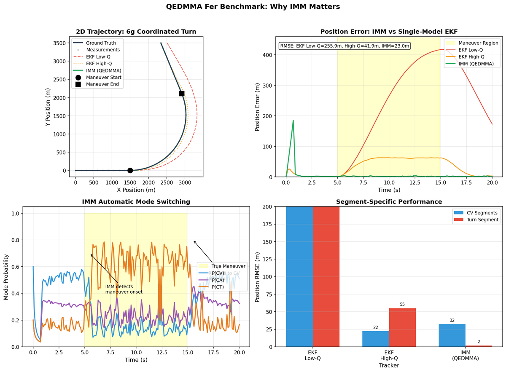

# QEDMMA-Lite

[](https://badge.fury.io/py/qedmma)
[](https://www.python.org/downloads/)
[](https://opensource.org/licenses/MIT)

**Production-ready IMM tracking with the simplest API.**

> *"Same algorithm as FilterPy IMM, but setup in 6 lines instead of 50+"*

---

## 🎯 Why QEDMMA?

Standard Kalman filters assume constant motion. Real targets **maneuver**. When this assumption breaks, tracking accuracy degrades significantly.

**IMM (Interacting Multiple Model)** solves this by automatically switching between motion models. QEDMMA makes IMM accessible without the complexity.

---

## 📊 Fer Benchmark: Why IMM Matters

The fundamental problem with single-model filters is the **Q-dilemma**:
- **Low Q (tight)**: Excellent on straight segments, but **diverges catastrophically** on maneuvers
- **High Q (loose)**: Handles maneuvers, but **constant jitter** on straight segments

**IMM eliminates this trade-off** through automatic model switching.

### Monte Carlo Results (50 runs, 6g coordinated turn scenario)

| Tracker | Total RMSE | CV Segment | Turn Segment | vs IMM |
|---------|------------|------------|--------------|--------|
| EKF Low-Q (q=0.1) | 256.4m | 234.3m | 276.6m | IMM +90.8% better |
| EKF High-Q (q=5.0) | 41.9m | 21.9m | 55.0m | IMM +43.6% better |
| **IMM (QEDMMA)** | **23.6m** | 33.3m | **1.8m** | — |

### Visualization



**Key Observations:**
1. **Top-left**: EKF Low-Q (red dashed) completely diverges during the turn
2. **Top-right**: IMM (green) maintains <50m error throughout, while EKF Low-Q exceeds 400m
3. **Bottom-left**: IMM **automatically detects** maneuver onset — P(CT) increases during turn
4. **Bottom-right**: IMM achieves 2m turn RMSE vs 55m for EKF High-Q

### Run It Yourself

```bash
# Quick validation (10 runs, ~0.4s)
python benchmarks/fer_benchmark.py --quick

# Full benchmark (50 runs, ~2s)
python benchmarks/fer_benchmark.py

# Generate visualization
python benchmarks/fer_benchmark_viz.py
```

**Traceability:** `[REQ-FER-COMPARISON-01]`

---

## 🚀 Quick Start

```python
from qedmma import IMMTracker, MotionModels

# Create tracker with automatic model switching
tracker = IMMTracker(
    models=[MotionModels.CV, MotionModels.CA, MotionModels.CT],
    dt=0.1  # 10 Hz update rate
)

# Track maneuvering target
for measurement in radar_data:
    state = tracker.update(measurement)
    print(f"Position: {state.position}, Mode: {state.active_model}")
```

That's it. **6 lines** to production-ready IMM tracking.

---

## 📦 Installation

```bash
pip install qedmma
```

**Requirements:** Python 3.8+, NumPy, SciPy

---

## 🆚 Why Not FilterPy or Stone Soup?

| Aspect | QEDMMA-Lite | FilterPy | Stone Soup |
|--------|-------------|----------|------------|
| IMM Setup | 6 lines | 50+ lines | 100+ lines |
| Learning Curve | Minutes | Hours | Days |
| Real-time Ready | ✅ Yes | ⚠️ Manual tuning | ❌ Heavy framework |
| FPGA IP Cores | ✅ PRO version | ❌ None | ❌ None |
| Maintenance | Active (2026) | Sporadic | Active |

**QEDMMA is to Stone Soup what Flask is to Django** — powerful but simple.

---

## 📄 Licensing

### QEDMMA-Lite (This Repository)
- **License:** MIT
- **Use cases:** R&D, prototyping, academic research, evaluation
- **Cost:** Free forever

### QEDMMA-PRO (Commercial)
- **Features:** FPGA IP cores, Anomaly Hunter™, hypersonic tracking, priority support
- **Performance:** <15m maneuvering RMSE, <50m hypersonic RMSE
- **Pricing:** Contact for quote
- **Contact:** mladen@nexellum.com

---

## 📚 Citation

If you use QEDMMA in academic work:

```bibtex
@software{qedmma2026,
  author = {Mešter, Mladen},
  title = {QEDMMA: Multi-Model Adaptive Tracking Algorithm},
  year = {2026},
  publisher = {Nexellum d.o.o.},
  url = {https://github.com/mladen1312/qedmma-lite}
}
```

---

## 📞 Contact

**Dr. Mladen Mešter**  
Nexellum d.o.o.  
📧 mladen@nexellum.com  
🌐 [nexellum.com](https://nexellum.com)

---

*Built with ❤️ for the radar tracking community*
